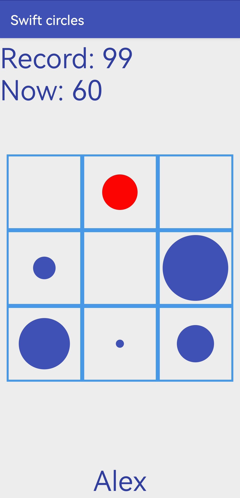
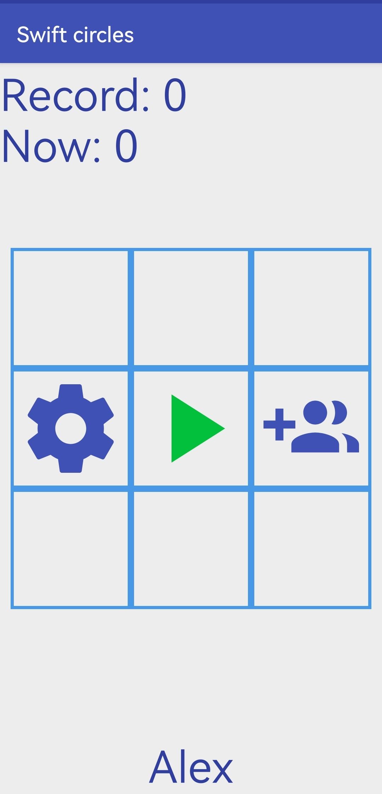
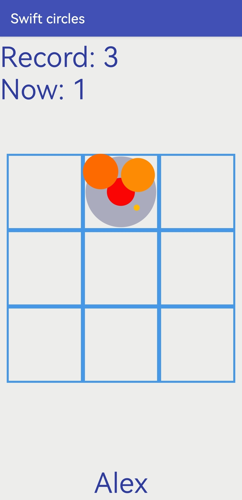

# Swift circles

### Description 

Simple game written in Java

  
  
  

### About creation
The game was written in 2017-2018 as an attempt to create a complete application, but at a certain point the development was stopped. And so in 2022 I decided to upload the project to github. This README was also written in 2022, when much about the application was forgotten.

### About game
+ Push "play" button and try to tap on blue circles in time. Do not tap on red circles, they blow up.
+ You can create up to 9 players on one device and set your own records.
+ You can change the player's name by clicking on it from the bottom of the screen.
+ There is pleasant music (for me), try it! You can turn it off in settings if you want.

### Problems
As far as I remember, there is a problem with a memory leak. I use something I should not for circles (or maybe I just don't clean memory) so after some time of playing the application starts to freeze and then crashes. At this point, the development was stopped.
